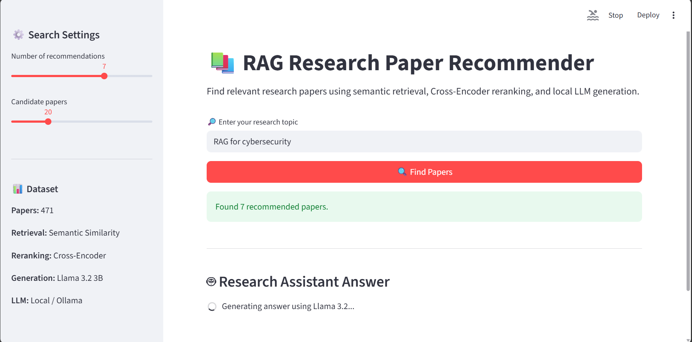

````markdown
# 📚 RAG Research Paper Recommender

A research paper recommendation system that combines **semantic retrieval, Cross-Encoder reranking, and Retrieval-Augmented Generation (RAG)** to help users discover relevant research papers using natural-language queries.

The system works with a collection of **471 research papers**, retrieves the most relevant papers, reranks them using a Cross-Encoder, and uses a local **Llama 3.2 3B** model through **Ollama** to generate answers based on the retrieved research context.

---

## 🚀 Features

- 🔎 Natural-language research topic search
- 🧠 Semantic search using Sentence Transformers
- 📊 Cosine similarity-based retrieval
- 🔄 Cross-Encoder reranking
- 🏷️ Research-domain clustering
- 🔍 Query expansion experiments
- 🤖 Retrieval-Augmented Generation (RAG)
- 🦙 Local LLM generation using Ollama
- 📄 Research paper metadata
- 🌐 Interactive Streamlit web application
- 💾 Cached embeddings for faster searches
- 📈 Retrieval evaluation using Precision@5, MRR, and nDCG@5
- 🔗 Direct links to available research papers

---

# 🧠 How It Works

The system follows a **two-stage retrieval pipeline followed by RAG generation**.

```text
                 User Research Query
                         │
                         ▼
              ┌─────────────────────┐
              │  Semantic Encoding  │
              │ Sentence Transformer│
              └──────────┬──────────┘
                         │
                         ▼
              ┌─────────────────────┐
              │  Cosine Similarity  │
              │   Candidate Search  │
              └──────────┬──────────┘
                         │
                    Top Candidates
                         │
                         ▼
              ┌─────────────────────┐
              │   Cross-Encoder     │
              │      Reranking      │
              └──────────┬──────────┘
                         │
                         ▼
                  Top-Ranked Papers
                         │
                         ▼
              ┌─────────────────────┐
              │        RAG          │
              │ Query + Paper       │
              │ Context             │
              └──────────┬──────────┘
                         │
                         ▼
              ┌─────────────────────┐
              │      Ollama         │
              │   Llama 3.2 3B      │
              └──────────┬──────────┘
                         │
                         ▼
                  Generated Answer
````

### Step 1 — User Query

The user enters a research topic such as:

```text
RAG applications in healthcare and medical diagnosis
```

---

### Step 2 — Semantic Encoding

The query is converted into a vector representation using:

```text
all-MiniLM-L6-v2
```

The same embedding model is used to represent the research papers.

This allows the system to compare the **meaning** of the query with the meaning of each paper rather than relying only on exact keyword matches.

---

### Step 3 — Candidate Retrieval

Cosine similarity is calculated between the query embedding and the stored paper embeddings.

The most similar papers are selected as candidates.

For example:

```text
471 papers
    ↓
Semantic similarity
    ↓
Top 20 candidates
```

---

### Step 4 — Cross-Encoder Reranking

The candidate papers are passed to:

```text
cross-encoder/ms-marco-MiniLM-L-6-v2
```

The Cross-Encoder receives:

```text
Query + Paper
```

and calculates a relevance score.

The candidate papers are then sorted according to these scores.

```text
Top 20 candidates
       ↓
Cross-Encoder
       ↓
Reranked candidates
       ↓
Top 5 papers
```

---

### Step 5 — RAG Generation

The top-ranked papers provide the context for the generation stage.

The system combines:

```text
User Query
     +
Retrieved Research Papers
     ↓
   RAG Context
     ↓
Local LLM
     ↓
Generated Answer
```

This helps the LLM generate an answer based on the retrieved research material.

---

# 🏗️ System Architecture

The complete system can be divided into four major components:

```text
┌─────────────────────────────────────────┐
│              User Interface             │
│               Streamlit                 │
└────────────────────┬────────────────────┘
                     │
                     ▼
┌─────────────────────────────────────────┐
│          Research Paper Retrieval        │
│                                         │
│  Sentence Transformer → Cosine Search   │
└────────────────────┬────────────────────┘
                     │
                     ▼
┌─────────────────────────────────────────┐
│            Reranking Layer              │
│                                         │
│        Cross-Encoder Reranking          │
└────────────────────┬────────────────────┘
                     │
                     ▼
┌─────────────────────────────────────────┐
│              RAG Layer                  │
│                                         │
│      Retrieved Papers + Query           │
└────────────────────┬────────────────────┘
                     │
                     ▼
┌─────────────────────────────────────────┐
│             Generation Layer            │
│                                         │
│          Ollama + Llama 3.2 3B          │
└────────────────────┬────────────────────┘
                     │
                     ▼
               Final Answer
```

---

# 📊 Dataset

The project uses a cleaned dataset containing **471 research papers** related to Retrieval-Augmented Generation and its applications.

The dataset contains information such as:

* Paper title
* Authors
* Abstract
* Publication year
* Citation count
* DOI
* Paper URL
* Research domain

The data was collected, cleaned, processed, and prepared for semantic retrieval.

---

## 🏷️ Research Domains

The papers were organized into major research areas:

* 🏥 **Healthcare & Biomedical RAG**
* 🔐 **Industry, Cybersecurity & Code RAG**
* 🎓 **Education, Conversational & Agentic RAG**
* 📈 **RAG Evaluation & Advanced Techniques**
* 🧠 **Core RAG & Retrieval Methods**

---

# 🔎 Retrieval Pipeline

The recommendation system uses a two-stage retrieval approach.

## 1. Paper Text Preparation

Each paper is converted into a searchable text representation.

The primary representation uses:

```text
Title + Abstract
```

---

## 2. Embedding Generation

The paper text is converted into vector embeddings using:

```text
all-MiniLM-L6-v2
```

The embeddings are saved locally as:

```text
data/processed/paper_embeddings.npy
```

This avoids regenerating all paper embeddings every time the application starts.

---

## 3. Query Embedding

When a user searches for a topic, the query is converted into an embedding using the same model.

```text
Research Query
      ↓
Sentence Transformer
      ↓
Query Vector
```

---

## 4. Semantic Similarity

Cosine similarity is calculated between the query vector and all paper vectors.

```text
Query Vector
      ↓
Cosine Similarity
      ↓
471 Paper Embeddings
      ↓
Similarity Scores
```

The highest-scoring papers are selected as candidates.

---

## 5. Candidate Selection

The system initially retrieves a configurable number of candidates.

The default configuration is:

```text
candidate_k = 20
```

---

## 6. Cross-Encoder Reranking

The 20 candidates are then passed through the Cross-Encoder.

```text
Query + Candidate Paper
          ↓
    Cross-Encoder
          ↓
   Rerank Score
```

The papers are sorted by their reranking score.

The final number of recommendations can be configured by the user.

---

# 🤖 RAG Generation

After retrieving and reranking the papers, the system can use the papers as context for an LLM.

The RAG process is:

```text
User Query
     │
     ▼
Retrieve Relevant Papers
     │
     ▼
Cross-Encoder Reranking
     │
     ▼
Select Relevant Context
     │
     ▼
Construct RAG Prompt
     │
     ▼
Ollama + Llama 3.2 3B
     │
     ▼
Generated Research Answer
```

The goal is to make the generated answer more grounded in the retrieved research literature.

---

## 🦙 Local LLM with Ollama

The project uses:

```text
Ollama
    +
Llama 3.2 3B
```

The model runs locally.

This approach was selected after testing an external OpenAI API and encountering API quota limitations.

Using a local LLM provides:

* Local inference
* No external API quota dependency
* Easier experimentation
* More control over the generation environment

---

# 🔍 Query Expansion Experiment

Query expansion was explored as an additional retrieval strategy.

For example:

```text
Original Query:
RAG for medical diagnosis
```

The system could identify related terms such as:

```text
medical
healthcare
RAG
AI
clinical
LLMs
applications
diagnostic
```

These terms were used to construct an expanded query.

However, query expansion was treated as an **experimental technique** rather than the core final retrieval pipeline because it did not consistently improve retrieval performance across all evaluation queries.

---

# 📈 Retrieval Evaluation

The retrieval system was evaluated using:

* **Precision@5**
* **Mean Reciprocal Rank (MRR)**
* **nDCG@5**

### Query Expansion Experiment Results

| Metric      | Mean Score |
| ----------- | ---------: |
| Precision@5 |     0.6800 |
| MRR         |     0.7000 |
| nDCG@5      |     0.7431 |

### Metric Interpretation

**Precision@5**

Measures the proportion of relevant papers among the top 5 retrieved results.

**MRR**

Measures how highly the first relevant paper appears in the ranking.

**nDCG@5**

Measures ranking quality while giving higher importance to relevant papers appearing near the top.

---

# 🖥️ Streamlit Application

The project includes an interactive Streamlit application.

Users can:

* Enter a research topic
* Select the number of recommendations
* Select the number of candidate papers
* Search for relevant papers
* View reranking scores
* View paper metadata
* View research domains
* View authors
* View DOI
* Open the original paper
* Generate RAG-based answers

### Example Query

```text
RAG applications in healthcare and medical diagnosis
```

Example result information:

```text
Title
Year
Citations
Domain
Authors
DOI
Reranking Score
Paper Link
```

---

# 📸 Application Preview

Add screenshots of your working Streamlit application here.

Example:

```markdown

```

You can create an `images/` folder later:

```text
images/
└── app.png
```

Then replace the example image path with your actual screenshot.

---

# 📁 Project Structure

```text
RAG-Research-Paper-Recommender/
│
├── data/
│   ├── raw/
│   │   └── papers.csv
│   │
│   └── processed/
│       ├── rag_papers_clean_471.csv
│       └── paper_embeddings.npy
│
├── notebooks/
│   ├── 01_eda.ipynb
│   └── 02_nlp.ipynb
│
├── src/
│   ├── collect_papers.py
│   ├── recommender.py
│   └── generator.py
|
|── images/
|   |── app_running1.png
|   |── app_running2.png
|   |── app_running3.png
|
├── app.py
├── README.md
├── Project_report.md
├── requirements.txt
└── .gitignore
```

### Main Files

| File                    | Purpose                                        |
| ----------------------- | ---------------------------------------------- |
| `app.py`                | Streamlit web application                      |
| `src/recommender.py`    | Semantic retrieval and Cross-Encoder reranking |
| `src/generator.py`      | RAG answer generation                          |
| `src/collect_papers.py` | Research-paper data collection                 |
| `01_eda.ipynb`          | Exploratory data analysis                      |
| `02_nlp.ipynb`          | NLP and retrieval experiments                  |
| `requirements.txt`      | Python dependencies                            |
| `Project_report.md`     | Detailed project development report            |

---

# 🛠️ Technologies Used

| Category          | Technology                             |
| ----------------- | -------------------------------------- |
| Programming       | Python                                 |
| Data Processing   | Pandas, NumPy                          |
| Machine Learning  | Scikit-learn                           |
| Embeddings        | Sentence Transformers                  |
| Embedding Model   | `all-MiniLM-L6-v2`                     |
| Similarity        | Cosine Similarity                      |
| Reranking         | Cross-Encoder                          |
| Reranker Model    | `cross-encoder/ms-marco-MiniLM-L-6-v2` |
| LLM               | Llama 3.2 3B                           |
| Local LLM Runtime | Ollama                                 |
| Web Framework     | Streamlit                              |
| Experimentation   | Jupyter Notebook                       |
| Version Control   | Git & GitHub                           |

---

# ⚙️ Installation

## 1. Clone the Repository

```bash
git clone https://github.com/VishishtaPanuganti/RAG_Research_Paper_REcommender.git
cd RAG-Research-Paper-Recommender
```

---

## 2. Create a Virtual Environment

### Windows

```powershell
python -m venv venv
```

---

## 3. Activate the Environment

```powershell
venv\Scripts\activate
```

---

## 4. Install Dependencies

```powershell
pip install -r requirements.txt
```

---

# 🦙 Ollama Setup

Install Ollama and download the required model.

```powershell
ollama pull llama3.2:3b
```

Run the model:

```powershell
ollama run llama3.2:3b
```

Keep Ollama running when using the RAG generation component.

---

# ▶️ How to Run

## Run the Streamlit Application

From the project root:

```powershell
streamlit run app.py
```

The application will open in your browser.

---

## Run the Recommender Directly

```powershell
python src\recommender.py
```

This runs the semantic retrieval and Cross-Encoder reranking pipeline.

---

## Run the RAG Generator

First start Ollama:

```powershell
ollama run llama3.2:3b
```

Then:

```powershell
python src\generator.py
```

---

# 🧪 Experiments

The project was developed through multiple stages of experimentation.

Experiments included:

* Exploratory Data Analysis
* Data cleaning
* Text preprocessing
* Sentence embeddings
* PCA experiments
* K-Means clustering
* HDBSCAN clustering
* Research-domain identification
* Semantic retrieval
* Query expansion
* Cross-Encoder reranking
* Retrieval evaluation
* RAG generation
* OpenAI API integration
* Local LLM integration using Ollama
* Streamlit application development

The complete development history is documented in:

```text
Project_report.md
```

The report contains:

* Experiments
* Results
* Errors
* Debugging steps
* Approaches that were changed
* Reasons for design decisions
* Evaluation results
* Development observations

---

# 🧩 Key Design Decisions

## Why Semantic Retrieval?

Traditional keyword search can miss papers that discuss similar concepts using different terminology.

For example:

```text
medical diagnosis
```

and:

```text
clinical decision support
```

may be semantically related even if the exact keywords differ.

Semantic embeddings help capture these relationships.

---

## Why Cross-Encoder Reranking?

Semantic retrieval is efficient for searching the complete paper collection.

However, the initial ranking can be improved by performing a more detailed query-document comparison.

Therefore, the system uses:

```text
471 Papers
     ↓
Semantic Retrieval
     ↓
20 Candidates
     ↓
Cross-Encoder
     ↓
Final Ranked Papers
```

This provides a balance between retrieval efficiency and ranking quality.

---

## Why a Local LLM?

The project initially experimented with an external LLM API.

The API integration encountered an account quota limitation.

The project was therefore adapted to use:

```text
Ollama + Llama 3.2 3B
```

for local generation.

---

# 🚧 Future Improvements

Possible future improvements include:

* [ ] Hybrid keyword + semantic retrieval
* [ ] FAISS or Chroma vector database
* [ ] Improved query expansion
* [ ] Better document chunking
* [ ] Citation-aware ranking
* [ ] Paper summarization
* [ ] Paper comparison
* [ ] Publication-year filtering
* [ ] Research-domain filtering
* [ ] Conversational research assistant
* [ ] Advanced RAG evaluation
* [ ] Hallucination detection
* [ ] Online deployment
* [ ] Improved UI and visualization

---

# ⚠️ Limitations

* The current dataset contains 471 research papers.
* Retrieval quality depends on the quality of the collected metadata and abstracts.
* Cross-Encoder scores represent relevance scores and should not be interpreted as probabilities.
* RAG answers depend on the retrieved context and local LLM.
* The local LLM's generation quality depends on available hardware and model configuration.
* The system is intended for research-paper discovery and should not replace expert literature review.

---

# 🔐 Security

Do **not** commit API keys, passwords, tokens, or other credentials to GitHub.

If environment variables are used locally, keep them in a `.env` file and add it to `.gitignore`.

Recommended `.gitignore` entries:

```text
.env
venv/
__pycache__/
*.pyc
```

---

# 📚 Documentation

For the complete development history, experiments, errors, fixes, evaluation results, and design decisions, see:

**[Project Report](Project_report.md)**

---

# 👨‍💻 Author

**Vishishta Panuganti**

B.Tech — Data Science & Artificial Intelligence
Indian Institute of Technology Bhilai

---

# ⭐ Project Goal

The goal of this project is to build an end-to-end research-paper discovery system that combines:

```text
Information Retrieval
        +
Natural Language Processing
        +
Semantic Embeddings
        +
Cross-Encoder Reranking
        +
Retrieval-Augmented Generation
        +
Local LLMs
```

to make research exploration **faster, more relevant, and easier for users**.

````

```text
images/
└── app_running1.png
└── app_running2.png
└── app_running3.png
````


```markdown

```


